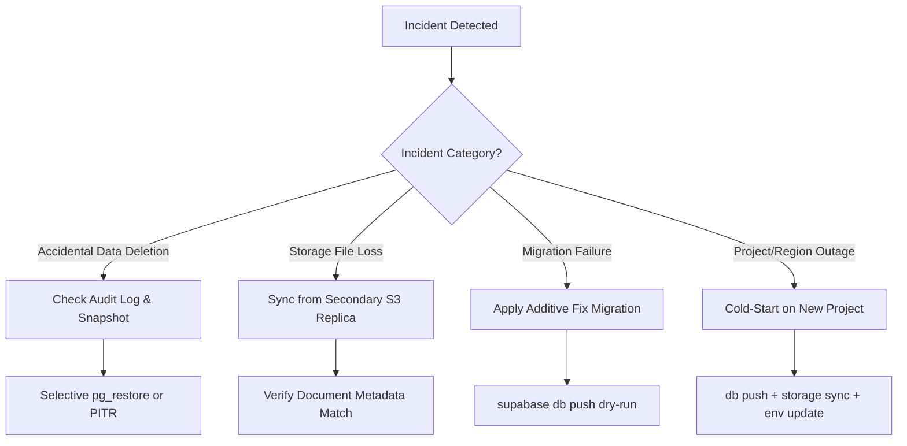

# Production Backup & Disaster Recovery Manual

> **Scope**: Supabase PostgreSQL Database, Storage Object Buckets, Additive Migrations, and Environment Secrets.  
> **Status**: Verified Operational Strategy for Production Deployment.

---

## 1. Executive Summary & Recovery Targets

This operational disaster recovery manual establishes the recovery procedures, data-loss scenarios, backup cadences, and realistic platform boundaries for the Agency Team Management system.

### Recovery Objectives

| Metric | Target | Rationale |
|---|---|---|
| **RPO (Recovery Point Objective)** | **< 24 hours** (Standard Daily Backup)<br>**< 5 minutes** (with Supabase Pro PITR add-on) | Standard daily snapshots protect against non-transient catastrophic loss. PITR is required if intra-day transaction loss cannot be tolerated. |
| **RTO (Recovery Time Objective)** | **< 60 minutes** (Selective Table Restore)<br>**< 120 minutes** (Full Project Re-provisioning) | Measured from outage diagnosis to healthy traffic resumption via Next.js SSR frontend. |

---

## 2. Platform Realities: What Is vs. What Is NOT Covered

> [!CAUTION]
> **Do not assume platform backups protect against all data loss.** Supabase provides powerful managed infrastructure, but default platform capabilities have distinct boundaries:

| Asset Layer | Included in Default Supabase Platform Backups? | What Is Actually Covered | What Is NOT Covered (Your Responsibility) |
|---|:---:|---|---|
| **PostgreSQL Database** | **YES** (Pro tier: daily snapshot, 7-day retention)<br>**NO** (Free tier: projects pause after inactivity) | Logical dump of all schemas (`public`, `auth`, `storage`, `graphql_public`). | Point-in-time recovery down to the minute/second (requires paid PITR add-on). Cold offsite replication outside AWS/Supabase region. |
| **Storage Object Binaries (S3)** | **NO** | Database rows in `storage.objects` and `storage.buckets` metadata. | **File binaries in buckets are NOT backed up by database snapshots.** If a file is deleted from S3 or corrupted, DB restore will not recover the binary. |
| **Additive Migrations** | **NO** (Indirect via DB state) | The `supabase_migrations.schema_migrations` table records applied versions. | SQL migration files in git repository, migration dry-runs, and CI/CD schema synchronization. |
| **Environment Secrets** | **NO** | Nothing. Environment variables and dashboard settings are excluded from database snapshots. | `.env.local` keys, Supabase Service Role Key, JWT Secret, SMTP credentials, Vercel/hosting configurations. |
| **Audit Logs** | **YES** (Included in DB dump) | Rows in `public.activity_logs` and `public.activity_logs_archive`. | Protecting against manual SQL truncation/updates prior to Batch 19 immutability triggers. |

---

## 3. Database Backup & Restore Strategy

### 3.1 Backup Approaches

#### A. Managed Daily Snapshots (Supabase Platform)
- **Mechanism**: Automated logical pg_dump run by Supabase infrastructure every 24 hours.
- **Retention**: 7 days rolling retention on standard Pro plans.
- **Access**: Supabase Dashboard -> **Database** -> **Backups** -> **Scheduled Backups**.

#### B. Continuous Physical Archiving (PITR Add-on)
- **Mechanism**: Write-Ahead Logging (WAL) archiving to durable physical cloud storage.
- **Capability**: Rollback to any specific second within the retention window (7 to 28 days).
- **Recommended For**: Production enterprise deployments where losing up to 24 hours of task, attendance, or report entries is unacceptable.

#### C. Manual / Automated Off-Site Logical Dumps (Self-Managed)
To prevent vendor lock-in and provide sovereign backups outside the Supabase project:
```bash
# 1. Full schema + data dump via Supabase CLI
supabase db dump --project-ref <PROJECT_REF> -f backup_full_$(date +%Y%m%d).sql

# 2. Data-only dump (ideal for restoring data on top of checked-in migrations)
supabase db dump --project-ref <PROJECT_REF> --data-only -f backup_data_$(date +%Y%m%d).sql

# 3. Direct pg_dump via connection pooler (Session pooler port 5432)
pg_dump -h db.<PROJECT_REF>.supabase.co -p 5432 -U postgres -d postgres \
  --format=custom --file=backup_$(date +%Y%m%d).dump
```

### 3.2 Database Restore Playbooks

#### Scenario A: Full Project Rollback via Dashboard
1. Navigate to **Database** -> **Backups** in the Supabase Studio.
2. Select the desired restore snapshot.
3. Click **Restore**.
4. **Impact**: The database will undergo brief downtime (typically 5–15 minutes). All tables, relations, and auth users revert to the snapshot timestamp.

#### Scenario B: Selective Table Restoration (Preventing Full Outage)
When data corruption or accidental deletion affects only a specific table (e.g. `tasks` or `employees`):
```bash
# 1. Restore the custom-format dump into a temporary local or shadow database
createdb shadow_recovery
pg_restore -d shadow_recovery backup_20260915.dump

# 2. Extract only the affected table's missing rows
pg_dump -d shadow_recovery -t public.tasks --data-only --inserts > tasks_recovered.sql

# 3. Apply recovered rows into the live database
psql -h db.<PROJECT_REF>.supabase.co -U postgres -d postgres -f tasks_recovered.sql
```

#### Scenario C: Preserving Append-Only Audit Logs During Restores
> [!IMPORTANT]
> The Batch 19 database trigger `trg_activity_logs_immutable` prohibits `UPDATE` and `DELETE` on `activity_logs`.
> When restoring historical tables, `activity_logs` remains append-only. If a full pg_restore requires dropping or recreating objects, the restore script must execute with superuser/session privileges or temporarily bypass triggers using:
> ```sql
> SET session_replication_role = 'replica';
> -- Run restore commands here
> SET session_replication_role = 'origin';
> ```

---

## 4. Storage Binary (Files & Documents) Recovery Strategy

### 4.1 Storage Inventory

The application manages 9 private storage buckets with strict RLS enforcement:
1. `avatars`: Employee profile pictures (`<profile_id>/avatar`).
2. `task_attachments`: Private task attachments scoped to task collaborators.
3. `daily_report_attachments`: Daily work report attachments.
4. `documents`: General company/employee documents.
5. `employee_documents`: Sensitive HR/personnel documents.
6. `project_documents`: Project deliverables and contracts.
7. `company_documents`: Organization-wide policies and announcements.
8. `sops`: Standard Operating Procedures.
9. `templates`: Reusable forms and templates.
10. `knowledge_base`: Knowledge base attachments.

### 4.2 Storage Backup Strategy (Offsite S3 Replication)

Because Supabase does not snapshot bucket binaries in database backups, an external replication job must be scheduled (e.g., via GitHub Actions or daily cron):
```bash
# Using rclone or AWS CLI with Supabase S3-compatible credentials
# Target: Cloudflare R2 / AWS S3 secondary bucket

rclone sync supabase-s3:avatars backup-s3:agency-storage-backup/avatars
rclone sync supabase-s3:task_attachments backup-s3:agency-storage-backup/task_attachments
rclone sync supabase-s3:documents backup-s3:agency-storage-backup/documents
rclone sync supabase-s3:employee_documents backup-s3:agency-storage-backup/employee_documents
rclone sync supabase-s3:project_documents backup-s3:agency-storage-backup/project_documents
rclone sync supabase-s3:daily_report_attachments backup-s3:agency-storage-backup/daily_report_attachments
```

### 4.3 Storage Recovery & Orphan Reconciliation
- **Binary Loss with Intact DB**: Re-sync missing storage keys from the backup bucket to the primary Supabase bucket using `rclone copy`.
- **Orphan Metadata Detection**: Run `npm run verify:backup` to scan for `public.documents` rows whose `storage_path` cannot be resolved in `storage.objects`.

---

## 5. Migrations & Schema Drift Recovery

### 5.1 Architecture
- **Location**: `supabase/migrations/` (27 sequential SQL migrations from initial schema to Batch 19 audit hardening).
- **Tracking Table**: `supabase_migrations.schema_migrations` inside PostgreSQL.
- **Rule**: All production schema changes are **additive only**. Never edit an already-applied historical migration file in production.

### 5.2 Schema Recovery Playbooks

#### Check Migration Sync
```bash
# List local vs remote migration status
npx supabase migration list
```

#### Recovering from a Failed Migration
If a migration fails midway in staging/production:
```bash
# 1. Investigate the failure and check applied status
npx supabase migration list

# 2. If the migration was partially applied or failed:
# NEVER manually drop or rewrite historical migrations.
# Write a new additive corrective migration:
# e.g., supabase/migrations/YYYYMMDDHHMMSS_fix_<issue>.sql

# 3. If Supabase CLI marks the version as applied erroneously:
npx supabase migration repair --status reverted <MIGRATION_VERSION>

# 4. Dry-run and re-apply
npx supabase db push --dry-run
npx supabase db push
```

#### Cold-Start Rebuild on a Brand-New Supabase Project
To reconstruct the entire database schema from zero on a new project instance:
```bash
# 1. Link project CLI
npx supabase link --project-ref <NEW_PROJECT_REF>

# 2. Push complete 27-migration schema sequentially
npx supabase db push

# 3. Provision the initial super-admin
node --env-file=.env.local scripts/provision-first-admin.mjs

# 4. Verify system isolation, RLS, and routes
npm run verify:rls
npm run verify:routes
npm run verify:audit
npm run verify:backup
```

---

## 6. Environment Configuration & Secrets Recovery

### 6.1 Critical Secrets Inventory

| Environment Variable | Where Used | Loss Impact | Recovery Procedure |
|---|---|---|---|
| `NEXT_PUBLIC_SUPABASE_URL` | Client + Server SSR | App unable to locate API gateway | Retrieve from Supabase Project Settings -> API. Update hosting environment. |
| `NEXT_PUBLIC_SUPABASE_PUBLISHABLE_KEY` | Client SSR / Anon | Unauthenticated public access fails | Retrieve from Supabase Project Settings -> API. Safe to redistribute. |
| `SUPABASE_SERVICE_ROLE_KEY` | Server API & Admin Jobs | Admin mutations, seed, and background jobs fail | Retrieve from Supabase Project Settings -> API. **NEVER expose on client**. |
| `SUPABASE_ACCESS_TOKEN` | Supabase CLI & CI/CD | Migrations and CLI automation fail | Regenerate in Supabase User Account -> Access Tokens. |
| `VERIFY_ADMIN_EMAIL` / `PASSWORD` | Verification Suite | Automated test/verification scripts fail | Reset password in Supabase Auth or re-run `provision-first-admin.mjs`. |

### 6.2 Key Compromise / Rotation Procedure
If the `SUPABASE_SERVICE_ROLE_KEY` or JWT secret is compromised:
1. Go to Supabase Dashboard -> **Project Settings** -> **API**.
2. Click **Generate a new JWT secret**.
3. *Note*: This immediately invalidates all active user sessions and old service-role tokens.
4. Copy the new Service Role Key into production hosting environment variables (e.g. Vercel / AWS).
5. Trigger an immediate redeployment of the Next.js application.
6. Run `npm run verify:routes` and `npm run verify:rls` to verify connectivity.

---

## 7. Data-Loss Scenarios & Step-by-Step Response Playbooks



### Playbook 1: Accidental Employee Suspension or Role Alteration
1. **Audit Forensics**: Query `activity_logs` for `action_type = 'employee.suspended'` or `'employee.role_changed'`.
   ```sql
   SELECT actor_id, action_type, entity_id, metadata, created_at
   FROM public.activity_logs
   WHERE entity_type = 'employee' AND action_type LIKE 'employee.%'
   ORDER BY created_at DESC LIMIT 10;
   ```
2. **Action**: Revert status via admin API `PATCH /api/admin/employees/:id` or direct admin SQL update. Immutability trigger ensures original incident record remains intact for accountability.

### Playbook 2: Accidental File / Document Deletion
1. Inspect `activity_logs` for `action_type = 'file.deleted'`. The metadata retains the exact `storage_path` and `file_name`.
2. Retrieve the deleted binary from secondary cold storage backup.
3. Upload binary back to the original bucket at the exact `storage_path`.
4. Re-insert the document metadata row into `public.documents` if metadata was deleted.

### Playbook 3: Total Cloud Region Disruption / Supabase Project Rebuild
1. Create a replacement project in an active region.
2. Update `.env.local` / CI secrets with the new URL and keys.
3. Push schema: `npx supabase db push`.
4. Restore data dump: `psql -h <NEW_HOST> -U postgres -d postgres < backup_data_latest.sql`.
5. Restore storage buckets via `rclone copy backup-s3: <NEW_SUPABASE_S3>:`.
6. Run full verification suite:
   ```bash
   npm run verify:rls
   npm run verify:routes
   npm run verify:audit
   npm run verify:backup
   ```
7. Re-point DNS domain to the new environment.

---

## 8. Backup Verification & Readiness Tooling

To ensure the system is continuously prepared for disaster recovery, run the automated readiness runner:

```bash
npm run verify:backup
```

This automated validator checks:
1. **Environment Completeness**: Validates that all critical variables exist without exposing their secrets.
2. **Database Connectivity**: Executes authenticated and service-role ping checks.
3. **Storage Health**: Inspects and confirms existence of all 9 active storage buckets.
4. **Referential Integrity**: Scans for orphaned database documents referencing missing storage files.
5. **Audit Guardrails**: Confirms `activity_logs` immutability trigger and `activity_logs_archive` table exist.
